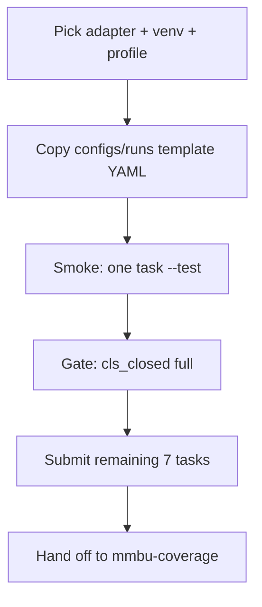

# MMBU onboard model

New model → smoke → 8-task submit. **Do not copy `eval/*_eval*.sh`.**

## Workflow



## Step 1 — Adapter and run config

Pick `--type` from `src/models/__init__.py`. Copy nearest YAML in `configs/runs/`:

| Model family | Template YAML | `--type` |
|--------------|---------------|----------|
| Qwen3.6 vLLM | `qwen36_27b_fp8_vllm_cot.yaml` | `qwen3_6_vllm` |
| Qwen3.6 Transformers | `qwen36_27b_fp8_cot.yaml` | `qwen3_6` |
| OctoMed vLLM | `octomed2_8b_vllm_cot.yaml` | `octomed_vllm` |
| Qwen2.5-VL | copy from existing qwen25 eval config values | `qwen2_5vl` |
| Qwen3-VL | — | `qwen3vl` |
| InternVL | — | `intern` |
| Gemma 3 | `gemma_cot.yaml` | `gemma3` |
| LLaVA / LLaVA-Med | — | `llava` / `llavamed` |
| Anthropic / OpenAI / Gemini | API example configs | `anthropic` / `openai` / `gemini` |

Edit in the copied YAML:

- `model.name` — HF repo id or API model id
- `runtime.output_dir` — usually `/pasteur/u/rdcunha/code/mmbu/results_cot_v3`
- `execution.inference_profile` — match venv (see reference)
- `execution.job_prefix` — unique Slurm job name prefix

## Step 2 — Venv and Slurm profile

Activate the venv that matches the adapter **before** local smoke tests. Slurm profiles in `configs/cluster.yaml` set `venv_activate` for submitted jobs.

See [reference.md](reference.md) for the full adapter → venv → profile table.

## Step 3 — Cache exports

Every GPU/sbatch job must export pasteur cache paths (workspace rule). Unified submit renders these via `src/mmbu/slurm.py`. Never paste HF tokens into sbatch scripts — use `.env` for API keys.

## Step 4 — Smoke test

```bash
cd /pasteur/u/rdcunha/code/mmbu/inference
source .venv/bin/activate   # or qwen36-vllm/bin/activate, etc.
export PYTHONPATH=src

python -m mmbu submit \
  --config configs/runs/<your_run>.yaml \
  --stages infer \
  --tasks cls_closed \
  --test \
  --dry-run

python -m mmbu submit \
  --config configs/runs/<your_run>.yaml \
  --stages infer \
  --tasks cls_closed \
  --test \
  --launch
```

Or local infer without Slurm:

```bash
python -m mmbu infer \
  --config configs/runs/<your_run>.yaml \
  --type qwen3_6_vllm \
  --name Qwen/Qwen3.6-27B-FP8 \
  --tasks cls_closed \
  --test
```

## Step 5 — Gate then full rollout

After smoke passes, run `cls_closed` at full scale, then remaining tasks:

```bash
python -m mmbu submit \
  --config configs/runs/<your_run>.yaml \
  --stages infer \
  --isolate-tasks \
  --launch
```

**Qwen3.6 vLLM cutover** — use the helper instead of manual steps:

```bash
bash scripts/submit_qwen36_vllm_infer.sh smoke
bash scripts/submit_qwen36_vllm_infer.sh gate
bash scripts/submit_qwen36_vllm_infer.sh remaining
```

Docs: `docs/qwen36_vllm_cutover.md`.

## Step 6 — API / frontier models

Read `FRONTIER_MODEL_INSTRUCTIONS.md`. Secrets in `.env` only (`src/env_utils.py` loads them).

Anthropic full benchmark:

```bash
python src/run_anthropic_batch.py preflight --config configs/anthropic_sonnet5.yaml
python src/run_anthropic_batch.py smoke --config configs/anthropic_sonnet5.yaml
python src/run_anthropic_batch.py submit --config configs/anthropic_sonnet5.yaml
```

Cost-check before full submit (~77k requests). OpenAI: `src/run_openai_batch.py` with analogous subcommands.

After API collect completes → use **mmbu-coverage** for judge queue.

## Step 7 — No-image ablation

Add `--no-image` to infer/submit/run. Output dir becomes `{model_stem}_no_image/`. See mmbu-coverage for JSONL naming.

## Step 8 — Hand off

Use **mmbu-coverage** to track JSONL completion and queue judge for the six judgeable tasks.

## Do not

- Copy `eval/cls_eval-*.sh`, `eval/q_eval-*.sh`, or other legacy per-model scripts
- Skip smoke before 8-task `--isolate-tasks` submit
- Use `.venv` for Qwen3.6 vLLM or judge workloads (wrong deps)
- Run Gemma through unified submit if the run config is not yet validated — fallback is `run_vlm_eval_gemma.py` (legacy)

## Reference

Adapter matrix, aliases, cluster profiles: [reference.md](reference.md)
